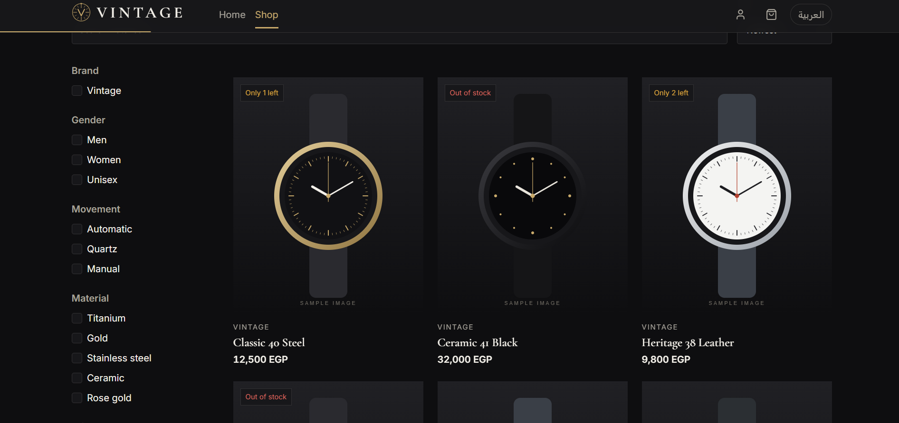
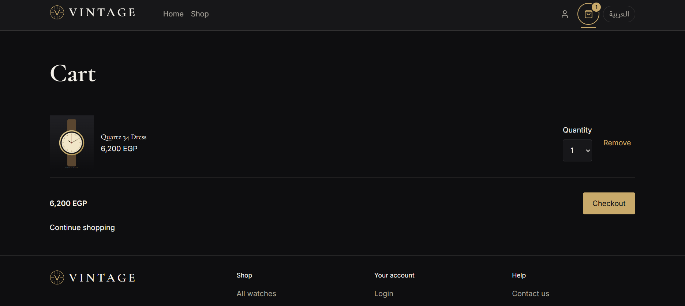
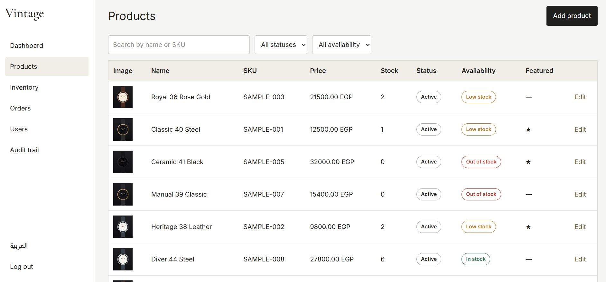
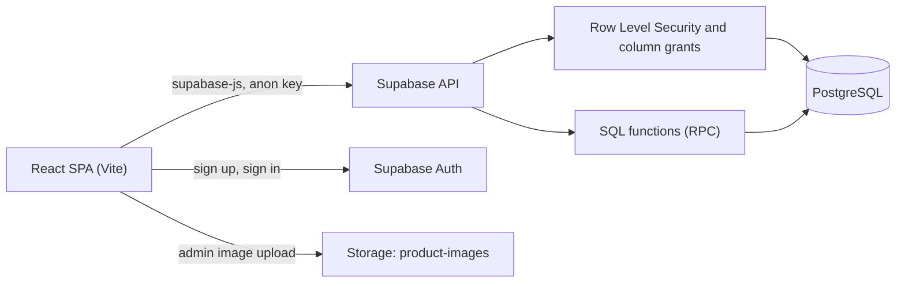
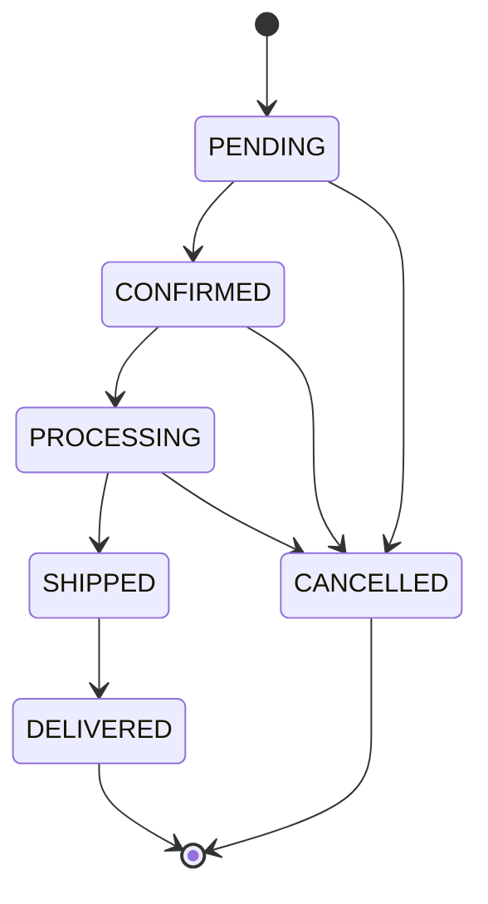

<div align="center">

# Vintage

**A bilingual (Arabic RTL / English LTR) luxury watch store built with React and Supabase.**


[Features](#features) ·
[Architecture](#architecture) ·
[Getting started](#getting-started) ·
[Documentation](#documentation) ·
[Deployment](#deployment) ·
[Contributing](#contributing)

</div>


  Add screenshots once you have them (store the images in docs/screenshots/), then uncomment this block:

  ## Screenshots

  | Home | Shop |
  | --- | --- |
  |  |  |

  | Checkout | Admin dashboard |
  | --- | --- |
  |  |  |


## Table of contents

- [Overview](#overview)
- [Features](#features)
- [Tech stack](#tech-stack)
- [Architecture](#architecture)
- [Getting started](#getting-started)
- [Configuration](#configuration)
- [Scripts](#scripts)
- [Project structure](#project-structure)
- [Business rules](#business-rules)
- [Documentation](#documentation)
- [Testing](#testing)
- [Deployment](#deployment)
- [Roadmap](#roadmap)
- [Contributing](#contributing)
- [Security](#security)
- [License](#license)

## Overview

Vintage is an online store for luxury watches, designed for the Egyptian market. Visitors browse and search the catalog, customers register, check out with **cash on delivery** and track their orders, and administrators manage products, stock, orders and users from a dedicated dashboard.

The project is **specification-driven**: every business rule, state machine and user flow is written down in [`docs/`](docs/) first, and the code implements those documents. Business logic lives in small, tested modules, and the database enforces the critical rules, so the behavior does not depend on what the frontend happens to do.

## Features

### Storefront
- **Bilingual:** Arabic (default, right-to-left) and English, switchable from the header. All user-facing text comes from locale files.
- **Catalog:** Arabic-aware search, filters (brand, price, gender, movement, material, in stock), sorting and pagination. All state is kept in the URL, so links are shareable.
- **Product pages:** image gallery, specifications and stock-aware availability messages.
- **Cart:** works for guests (stored in the browser) and customers (stored on the server). A guest cart is merged on login, and prices and stock are revalidated before checkout.
- **Checkout:** three steps (address, review, confirmation), cash on delivery, protection against double submission.
- **Customer account:** profile, saved addresses, order history, and cancellation while an order is still pending.
- **Design system:** dark, premium visual language with design tokens, scroll and hover motion, full support for `prefers-reduced-motion`.

### Admin dashboard (`/admin`)
- **Products:** create, edit, publish, unpublish, archive, feature; bilingual content; image upload and ordering.
- **Inventory:** set or adjust stock with a reason; every change is written to an inventory log.
- **Orders:** full status workflow that only offers the legal next actions; cancellation requires a reason and restores stock automatically; internal notes.
- **Users:** enable or disable accounts.
- **Audit trail:** a read-only log of important actions.

## Tech stack

| Area | Technology |
| --- | --- |
| Frontend | React, TypeScript (strict), Vite |
| Styling | Tailwind CSS with CSS-variable design tokens |
| Routing | React Router (`/ar/*` and `/en/*`) |
| Backend | Supabase: PostgreSQL, Auth, Storage, Row Level Security, SQL functions |
| Data fetching | `@supabase/supabase-js`, TanStack Query |
| Forms and validation | React Hook Form, Zod |
| Internationalization | i18next, react-i18next |
| Motion | motion, GSAP (ScrollTrigger), Lenis |
| Icons | lucide-react |
| Testing | Vitest |

## Architecture

There is **no custom backend server**. The React app talks directly to Supabase, and all protection is enforced inside the database.



### Security model
- **Row Level Security** controls who can read what: customers only see their own data, and draft or archived products are hidden from the public.
- **Column-level grants** make sensitive fields read-only for clients: stock, product status, order status, user roles and carts can only change through SQL functions, never through direct table writes.
- **Atomic checkout:** placing an order is one transaction that locks the affected products in a stable order, so two people buying the last unit at the same time cannot both succeed. Orders are idempotent per submission key.
- **Server-side authority:** prices, totals, stock and permissions are always recomputed in the database. The frontend checks are only for user experience.
- The browser uses only the Supabase **anon (publishable)** key. The `service_role` key must never be placed in the frontend or committed to Git.

### Database functions (RPC)
| Function | Purpose |
| --- | --- |
| `cart_set_item`, `merge_guest_cart`, `validate_cart` | Cart changes, guest cart merge, price and stock revalidation |
| `place_order` | Atomic checkout with idempotency |
| `cancel_my_order` | Customer cancellation (pending orders only) |
| `admin_transition_order` | Order status workflow with optimistic concurrency |
| `admin_adjust_stock` | Stock changes with reason and log |
| `admin_set_product_status`, `admin_set_featured` | Product lifecycle and featured limit |
| `admin_set_user_enabled`, `admin_users`, `admin_dashboard_counts` | User management and dashboard data |

The complete contract (tables, columns, error codes) is in [`docs/API_CONTRACT.md`](docs/API_CONTRACT.md).

## Getting started

### Prerequisites
- Node.js 20.19 or newer
- A free [Supabase](https://supabase.com) account

### 1. Clone and install
```bash
git clone https://github.com/amrmarei-22/Watches_website.git
cd Watches_website
npm install
```

### 2. Create the Supabase project
1. Create a new project in Supabase and save the database password.
2. Open **SQL Editor** and run the full contents of [`supabase/setup_all.sql`](supabase/setup_all.sql) once. It contains the three files in `supabase/migrations/`, so do not run both.
3. *(Development only)* Run [`supabase/seed.sql`](supabase/seed.sql) to add eight sample watches.
4. Under **Authentication, Providers, Email**, keep **Confirm email** enabled.
5. Under **Authentication, URL Configuration**, set the Site URL to `http://localhost:5173` and add `http://localhost:5173/**` to the redirect URLs.

### 3. Configure environment variables
Create `.env.local` in the project root. It is ignored by Git.

```env
VITE_SUPABASE_URL=your-project-url
VITE_SUPABASE_ANON_KEY=your-anon-or-publishable-key
```

You can find both values in Supabase under **Project Settings, API**.

### 4. Run the app
```bash
npm run dev
```
Open the URL printed in the terminal (normally `http://localhost:5173`).

### 5. Create an administrator
Register a normal account in the app and confirm its email address. Then run this in the Supabase SQL Editor:

```sql
update public.profiles set role = 'ADMIN'
where id = (select id from auth.users where email = 'YOUR_EMAIL');
```

Administrators sign in at `/en/admin/login` or `/ar/admin/login`. Use a different account from the one you use to shop.

### 6. Set the shipping fee (optional)
Amounts are stored in piasters, so `5000` equals 50 EGP.

```sql
update public.app_settings set shipping_flat_fee = 5000 where id = 1;
```

## Configuration

| Variable | Required | Description |
| --- | --- | --- |
| `VITE_SUPABASE_URL` | Yes | Supabase project URL |
| `VITE_SUPABASE_ANON_KEY` | Yes | Supabase anon (publishable) key |

Business constants (low-stock threshold, per-line quantity limit, session timeouts, brand name, contact details) are defined in a single file, `src/config/businessConfig.ts`. The matching database constants live in the `app_settings` table.

## Scripts

| Command | Description |
| --- | --- |
| `npm run dev` | Start the development server |
| `npm run typecheck` | Run the TypeScript compiler without emitting files |
| `npm test` | Run the unit tests |
| `npm run build` | Create a production build in `dist/` |

## Project structure

```text
.
├── .github/
│   ├── copilot-instructions.md   Rules for AI coding assistants
│   └── prompts/                  Design skills used during development
├── docs/                         Specification (single source of truth)
├── supabase/
│   ├── migrations/               Tables, RLS policies and functions
│   ├── setup_all.sql             The migrations combined in one file
│   └── seed.sql                  Sample data for development
├── public/                       Logo and placeholder images
└── src/
    ├── app/                      Router, providers, layouts
    ├── config/                   businessConfig.ts
    ├── domain/                   Pure business logic: inventory, order state machine, permissions, money
    ├── features/                 catalog, cart, checkout, orders, account, auth, admin
    ├── components/               Reusable UI components
    ├── motion/                   Animation presets and hooks
    ├── locales/                  ar.json, en.json
    └── lib/                      Supabase client and i18n setup
```

## Business rules

| Topic | Rule |
| --- | --- |
| Currency | EGP, stored as integer piasters |
| Payment | Cash on delivery only |
| Low stock | 3 units or fewer (overridable per product) |
| Cart quantity | Up to 3 units of one product per line, never more than the available stock |
| Stock | Deducted when an order is created, restored when it is cancelled |
| Checkout | Requires a signed-in customer with a verified email |
| Cancellation | Customers can cancel only while the order is pending; afterwards only an admin can, with a reason |

Order lifecycle (no backward transitions):



Product availability (`IN_STOCK`, `LOW_STOCK`, `OUT_OF_STOCK`) is always derived from the stock number and is never stored.

## Documentation

| Document | Contents |
| --- | --- |
| [`PROJECT_SPEC.md`](docs/PROJECT_SPEC.md) | Scope, roles, data model, pages |
| [`BUSINESS_RULES.md`](docs/BUSINESS_RULES.md) | Every rule and constant, with identifiers |
| [`PRODUCT_STATES.md`](docs/PRODUCT_STATES.md), [`ORDER_STATES.md`](docs/ORDER_STATES.md) | Lifecycles and allowed transitions |
| [`USER_FLOW.md`](docs/USER_FLOW.md), [`ADMIN_FLOW.md`](docs/ADMIN_FLOW.md) | Storefront and admin flows |
| [`API_CONTRACT.md`](docs/API_CONTRACT.md) | Tables, functions and error codes the frontend may use |
| [`TECH_STACK.md`](docs/TECH_STACK.md) | Architecture, database design, localization rules |
| [`DESIGN.md`](docs/DESIGN.md), [`BRAND.md`](docs/BRAND.md) | Design system, motion and brand |
| [`HOME_AND_CHROME.md`](docs/HOME_AND_CHROME.md) | Header, footer, home page and static pages |
| [`UI_STATES.md`](docs/UI_STATES.md), [`i18n/`](docs/i18n/) | Loading, empty and error states, and all messages in both languages |

## Testing

```bash
npm test
```

The test suite covers the pure business logic (inventory availability, the order state machine, permissions, money formatting, cart behavior), the validation schemas, and an i18n integrity check that fails when a translation key is missing in either language.

Every row of the rule tables in `docs/` is expected to have at least one test.

## Deployment

The app is a static single-page application and can be hosted on Vercel, Netlify, Cloudflare Pages or any static host.

1. Set the build command to `npm run build` and the output directory to `dist`.
2. Add `VITE_SUPABASE_URL` and `VITE_SUPABASE_ANON_KEY` as environment variables on the host.
3. Enable the single-page-application fallback (rewrite every route to `index.html`). Without it, refreshing a URL such as `/en/shop` returns a 404.
4. Add the production URL to Supabase under **Authentication, URL Configuration**.

### Production checklist
- [ ] Use a clean Supabase project, or remove the sample products and test orders
- [ ] Add real products and photographs
- [ ] Configure a custom SMTP provider (the default Supabase mailer is heavily rate limited)
- [ ] Set the shipping fee and fill in the contact details in `businessConfig.ts`
- [ ] Add and legally review the privacy policy, terms and shipping policy content
- [ ] Review the Arabic copy listed in `src/locales/NEEDS_REVIEW.md`

### Product photography
Images are uploaded from the admin dashboard (**Products, Edit, Images**), which stores the file in the `product-images` Storage bucket and records it in the database. Recommended format: vertical 4:5, at least 1600 px wide, JPG, PNG or WebP, under 5 MB, up to 8 images per product. Only use photographs you own or are licensed to use.

## Roadmap

**Not in version 1:** online card payments, returns and refunds, discount codes, product reviews, wishlist, email or SMS notifications, social login, admin sub-roles.

**Planned improvements:** order notifications for administrators, server-side catalog queries for large inventories, an optional server-rendered storefront for stronger SEO.

## Contributing

Contributions are welcome. This project is specification-driven, so please follow these rules:

1. Read the relevant files in [`docs/`](docs/) before changing anything.
2. If behavior is not specified, open an issue or update the documentation first. Do not invent behavior in code.
3. Put business logic in `src/domain/` with tests. Do not hard-code constants (use `businessConfig.ts`) or user-facing text (use the locale files, and always update both languages).
4. Database changes go into a **new, numbered migration file**. Never edit a migration that has already been applied.
5. Before opening a pull request, run `npm run typecheck`, `npm test` and `npm run build`.

## Security

- Never commit `.env*` files or the Supabase `service_role` key.
- To report a vulnerability, please use GitHub's private vulnerability reporting (the repository's **Security** tab) if it is enabled, or contact the maintainer privately. Do not open a public issue for security problems.

## License

No license has been specified yet. Until one is added, all rights are reserved by the repository owner.